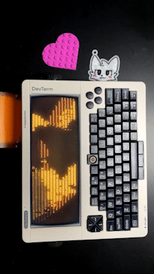

# Cyberdeck for Furum 2023

This is the code I used for my costume at Furum 2023!




📷 Photo by [@cabbageBits](https://twitter.com/cabbageBits)

**NOTE:** This code was originally meant to run on Raspbian/Linux, but modifications have been made to implement some of the same functionality on Windows.

## Hardware

- [DevTerm Kit RPI-CM4 Lite](https://www.clockworkpi.com/product-page/devterm-kit-cm4-series)
- [Peripage Mini Printer Paper Sticker](https://www.amazon.sg/dp/B08PVF2C3H?ref=ppx_yo2ov_dt_b_product_details&th=1) (or equivalent)
- [Universal Hand Strap Tablet Holder](https://www.amazon.sg/dp/B08YYWHRT3?ref=ppx_yo2ov_dt_b_product_details&th=1)
- [M56/T6-B1](https://www.machine56.com/product/m56-t6-b1) (or other arm strap solution)

## Dependencies

1. Install Python 3.9 or higher, if needed. ([Instructions](https://wiki.python.org/moin/BeginnersGuide/Download))
2. (Optional) Install `pipx`, if needed. ([Instructions](https://pipx.pypa.io/stable/installation/))
3. Install `poetry`, if needed. ([Instructions](https://python-poetry.org/docs/#installation))
   
   If you have `pipx`, you can do this by running:
   ```
   pipx install poetry
   ```
4. Go to the root of this repository and install the Python dependencies:
   ```
   poetry install --no-root
   ```
   If you want to convert MP4 videos, install the `convert` extra as well:
   ```
   poetry install -E convert --no-root
   ```
   The extra is not needed for the main `player.py` program.
5. (Optional) Install [cool-retro-term](https://github.com/Swordfish90/cool-retro-term) for some sick terminal effects.


## Environment Activation

Before any of the commands below will work, you need to activate the Python environment by going to the root of this repository and running:
```
poetry shell
```
You will need to redo this step if you ever exit the session (e.g., by running `exit` or closing the window).

## Main Program: `player.py`

Start the main program by running:
```
python player.py
```
### Keyboard Controls
- **1, 2, 3, etc.:** Switches to and loops a specific animation found in the `videos` folder
- **Space:** Switches to next animation
- **A:** Starts automatically switching through all the animations
- **P:** Prints the sticker found in `thermal.pdf` (**WARNING:** The print job will start automatically if your printer is ready)
- **C:** Prompts for a message and prints a custom sticker (**WARNING:** The print job will start automatically if your printer is ready)
- **Esc:** Quits the program

## Utility: `pdfgen.py`

If you just want to generate a custom PDF, run:
```
python pdfgen.py
```
The default output filename is `output.pdf`. You can specify a different name by running:

```
python pdfgen.py <outfile>
```
The "Cyberway Riders" font is from [here](https://www.dafont.com/cyberway-riders.font).

## Utility: `convert.py`

If you just want to convert an MP4 video to an ASCII animation, run:
```
python convert.py <infile> <outfile>
```
This functionality is based on the [`to-ascii`](https://github.com/Iapetus-11/To-ASCII) module in the `convert` extra. Frames are 15 characters tall and separated by `"\n\n\n"`. To modify these values, you will need to edit the source code.

## Utility: `matrix.py`

The looping "digital rain" effect in `videos/video5.txt` is generated using this custom program. (I had to write this because I couldn't find a version that looped.) If you just want to view the animation, run:
```
python matrix.py
```
To save the generated animation to a file, run:
```
python matrix.py <outfile>
```
The format of the output file is the same as the defaults for `convert.py`.